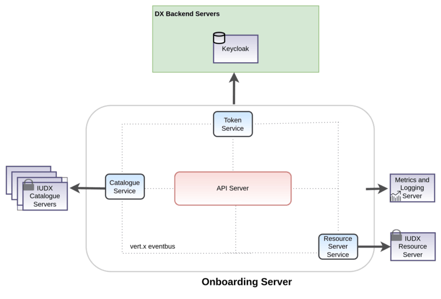

[%2520pipeline%2F)](https://jenkins.iudx.io/job/iudx%20onboarding%20%28v5.6.0%29%20pipeline/lastBuild/)
[%2520pipeline%2F)](https://jenkins.iudx.io/job/iudx%20onboarding%20%28v5.6.0%29%20pipeline/lastBuild/jacoco/)
[%2520pipeline%2F&label=Unit%20and%20Integration%20Tests)](https://jenkins.iudx.io/job/iudx%20onboarding%20%28v5.6.0%29%20pipeline/lastBuild/testReport/)
[%2520pipeline%2F&label=Security%20Tests)](https://jenkins.iudx.io/job/iudx%20onboarding%20%28v5.6.0%29%20pipeline/lastBuild/zap/)

# DX Onboarding Server
## Introduction
The Onboarding Server is DX's helper server for onboarding items, instances and middle layer 
metadata in a federated Catalogue server model.

## Features
- Create, Update or Delete Items, Instances and middle layer metadata in federated catalogue using a single API call.
- Support for failsafe and retry on failure of request on any of the servers.
- Auto create exchange for resource groups on item creation.
- Scalable, service mesh architecture based implementation using open source components: Vert.X API framework
- Hazelcast and Zookeeper based cluster management and service discovery

# Explanation
## Understanding Onboarding Server
- The section available [here](./docs/Solution_Architecture.md) explains the components/services 
  used in implementing the Onboarding Server.
- To try out the APIs, import the API collection, postman environment files in postman.
- Reference : [postman-collection](src/main/resources/), [postman-environment](src/main/resources/)

# How to Guide
## Setup and Installation
Setup and installation guide is available [here](./docs/SETUP-and-Installation)

# Reference
## API Docs 
API docs are available [here](https://cos.iudx.org.in/onboarding/apis).

## FAQ
FAQs are available [here](./docs/FAQ.md)
