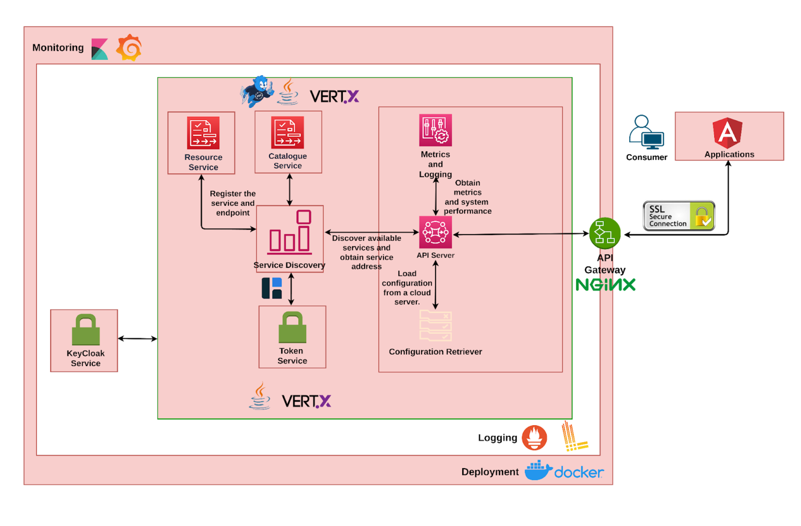

## Solution Architecture
The following block diagram shows different components/services used in implementing the 
Onboarding Server.

The above setup allows specific high load containers/services to scale with ease. Various 
services of the server are detailed in the section below.

### API Server
An API server is an HTTPS Web Server and serves as an API gateway for actors (providers, DX AAA Server) to interact with the different services provided by the DX Onboarding Server.
The API Server acts as the central component, responsible for processing incoming API requests and routing them to the appropriate internal services like the Catalogue Service and Resource Server Service. It serves as the primary entry point for all onboarding operations, enabling the creation, updating, and deletion of items, instances, and metadata in the system. By coordinating between different services, it ensures seamless interaction and communication across the Onboarding Server.

### Keycloak Module
Keycloak is used for identity and access management across the system. It manages user credentials, roles, and permissions, providing secure access to the system through OAuth2 and OpenID Connect. Keycloak integrates with the Token Service to ensure authenticated requests to the API Server.

### Metrics and Logging Server
This component monitors the performance of the system by collecting metrics and logs from various services like the API Server. It plays a critical role in system observability, helping with troubleshooting, performance monitoring, and ensuring smooth operation of the entire Onboarding Server.

### Catalogue Service
The Catalogue Service handles communication with DX Catalogue Servers, managing CRUD (Create, Read, Update, Delete) operations for items, instances, and middle layer metadata. It ensures that new items and their associated data are onboarded into the federated Catalogue. Using Vert.x EventBus, it efficiently handles asynchronous communication with other internal services.

### Resource Service
The Resource Service is a crucial part of the onboarding server responsible for managing resource server adapters. It facilitates the registration and unregistration of these adapters, ensuring they are properly integrated with the system. The service uses a retry mechanism to handle transient errors, enhancing reliability during operations. It interacts with both central and local catalogues to maintain consistency and works closely with the Ingestion Service to perform necessary adapter operations. Through its key methods, the Resource Service ensures that adapters are effectively registered or unregistered, logging the results to aid in troubleshooting and system monitoring. Overall, it plays an essential role in ensuring the smooth functioning and integration of the DX Resource Server within the onboarding framework.

### Ingestion Service
The Ingestion Service is an important part of the onboarding server that handles the 
registration and un-registration of resource server adapters. It connects resource servers with 
the catalogues, ensuring that all necessary information about each adapter is accurately recorded. This service processes incoming data, updates the central and local catalogues, and uses error handling and retry mechanisms to ensure reliable operations. Overall, it helps manage resource servers efficiently, allowing for smooth data flow and integration within the onboarding system.

### Token Service
The Token Service manages authentication and authorization using Keycloak. It handles token generation and validation to ensure secure access to various services within the DX ecosystem.
